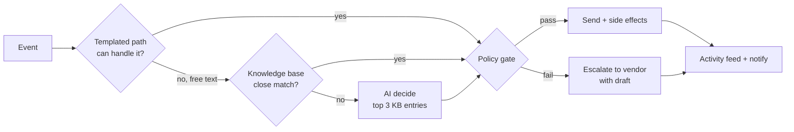
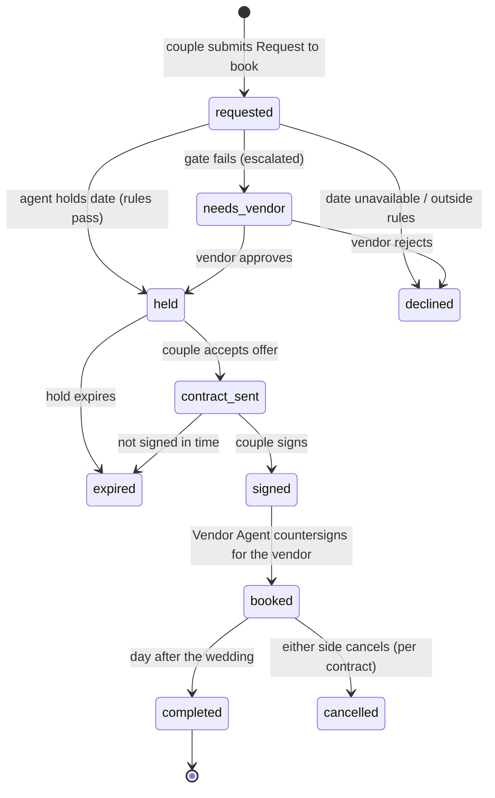
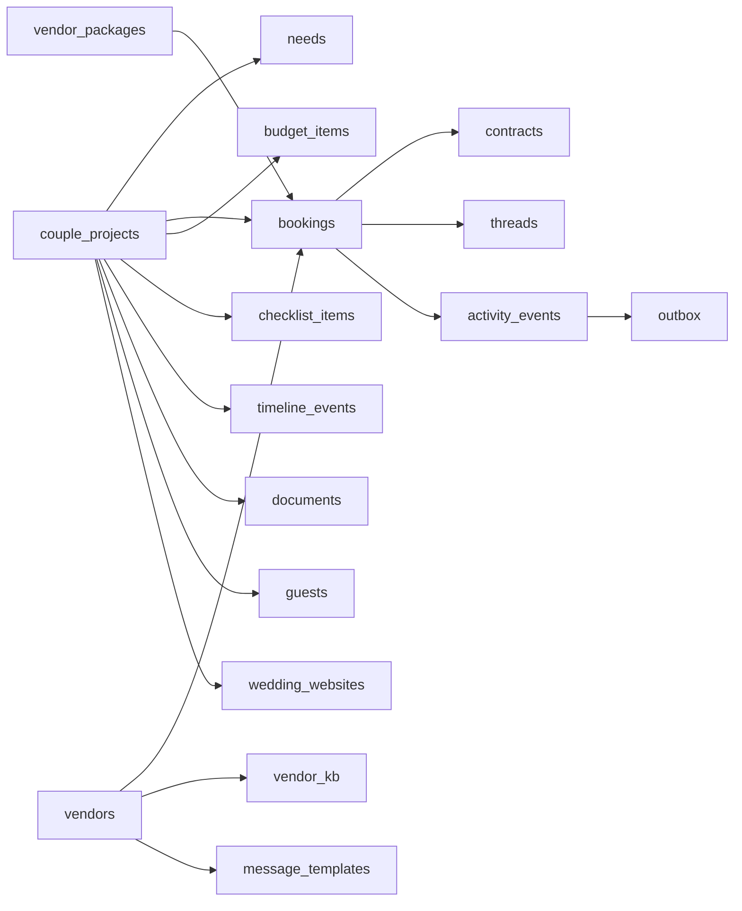
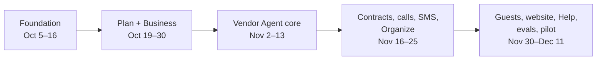

# Knotly MVP Spec — Forms-first Couples + Vendor AI Agent

Oct 4, 2026 · @Sanjay Ghimire

## 1. Summary and MVP scope

Knotly MVP is a sidebar web app with two dashboards: couples plan their wedding through forms, and vendors run their business with a **Vendor AI Agent** that handles inquiries, bookings, contracts, calls, texts, and follow-ups like a trained assistant, notifying the vendor of everything and escalating anything outside their rules. The couple's AI is an optional **Help assistant**, not the main interface. This spec supersedes the chat-first design in the earlier spec and tutorial; it reuses their database, gate, and agent code wherever possible.

**Design principles**

- **Forms first, AI where language is needed.** Structured input from forms means most vendor work is deterministic code and templates. AI only writes when a couple writes free text the knowledge base can't answer, or when a vendor asks for help drafting.
- **No-haggle packages.** Prices and deliverables are fixed and public, which removes negotiation and discount logic from the agent.
- **The agent works inside the vendor's box.** Rules, packages, calendar, call hours, templates, and knowledge base are data the policy gate checks in code.
- **The vendor always knows.** Every agent action lands in the activity feed; important ones also notify by email or text.
- **One booking event updates everything.** Booking a vendor updates the couple's budget, checklist, calendar, documents, and timeline automatically.

**In the MVP**

| Area | Included |
| --- | --- |
| Couple | Signup, wedding project, needs, vendor browsing and search, booking requests, messages, budget, checklist, wedding day timeline, calendar, documents, guest list, wedding website with RSVP, gift registry (links + cash fund link), Help assistant |
| Vendor | Signup, business details, no-haggle packages and deliverables, availability, call hours, contract template, message templates, knowledge base, reviews, plan and usage (Basic, Pro, Pay as you go), notification settings |
| Vendor AI Agent | Inquiry replies, knowledge-base answers, date holds, booking confirmation, contract send and e-sign, call scheduling, SMS and email notifications, timed follow-ups, escalations, activity feed, autonomy levels, pause and kill switch |

**Not in the MVP** (designed for, built later)

- Payments between couples and vendors: Knotly never handles them (no deposits, no payment processing). Contracts state amounts only.
- AI voice calls (MVP: follow-up texts/emails plus a "call this couple" reminder for the human vendor).
- Native gift registry checkout, seating charts, Google Calendar two-way sync, mobile apps.
- Multi-user vendor teams and planner accounts.

## 2. What we reuse

Most of the backend already exists in the tutorial (Lessons 1–19) and the agent kit. The biggest change is on the couple side: chat tools become forms (server actions), and the Vendor Agent gets a **templated path in front of the AI path**.

**Database** (tutorial migrations)

| Existing table / function | MVP decision | Change |
| --- | --- | --- |
| `profiles` + signup trigger, RLS | Keep | Add `phone_verified`, `sms_opt_in`, `notify_prefs`; drop guest/anonymous use (normal signup) |
| `metros` | Keep | — |
| `couple_projects` | Keep | Add `website_slug`, `budget_total` already exists; `needs` array replaced by `needs` table |
| `vendors` + embedding, `match_vendors()` | Keep | Used by Vendors search form |
| `vendor_packages` | Keep, extend | Add `deliverables`, `hours`, `retainer_amount` (shown in contracts only), `active`; prices are fixed (no discounts) |
| `testimonials` | Keep | Shown on vendor profile as Reviews |
| `threads`, `messages`, `owns_thread()` | Keep | Thread = conversation for one couple + vendor; add `booking_id` |
| `quotes` + `charge_estimate_view()` | Repurpose | Becomes the **estimate** (booking offer) for a package; when a couple opens it, Pay-as-you-go vendors are charged $1 (configurable) through `charge_estimate_view()` |
| `vendor_agent_settings`, `vendor_agent_rules` | Keep | Remove discount rules from UI (no-haggle) |
| `vendor_availability` | Keep | Holds created by booking requests |
| `consult_hours`, `consultations` | Keep | Calls (Lesson 19) |
| `escalations`, `agent_audit_log` | Keep | Shown as Needs you and Activity |
| `lead_credit_ledger`, `vendor_credit_balance()` | Keep | Replaced by `vendor_usage` (estimate views and SMS) and `plan_pricing` (section 9) |
| `pending_verifications`, `merge_guest_into_user()` | Drop | Couples sign up through a normal form |

**Service code**

| Existing | Reuse as |
| --- | --- |
| `src/lib/supabase/*`, `email.ts` (`notify`, `sendInvite`, `makeIcs`) | As-is |
| `src/lib/embeddings.ts`, `refreshVendorEmbedding` | As-is; also embeds knowledge base entries |
| `src/agent/vendor/*` (`context`, `decide`, `gate`, `pricing`, `act`, `responder`, `slots`, `rules`) | Core of the Vendor AI Agent; `decide()` is now the **fallback** after the templated path (section 7) |
| `api/escalations/[id]/resolve`, `api/cron/escalations`, `api/consultations` | As-is |
| `api/inquiries/[id]/send`, \`api/quotes/\[id\]/view | accept\` |
| Couple chat tools (`coupleTools`) | Retired; logic moves into server actions. A small read-only subset powers the Help assistant |
| Vendor config chat (`vendorTools`) | Kept as an optional "Set up with AI" helper; the forms are primary |
| Evals and gate tests (Lesson 18) | As-is, plus new cases for the templated path |

**UI**

| Existing | Reuse as |
| --- | --- |
| Sidebar dashboards (design canvas) | App shell, Couple Overview, Vendor Overview, palette and type |
| `VendorListCard`, `EstimateCard`, `CallTimesCard`, `EscalationCard` | Restyle into the new pages (vendor results, booking offer, call picker, Needs you) |
| `/vendor/inbox` | Becomes Needs you |
| Chat component | Becomes the Help assistant drawer (couple) and "Set up with AI" (vendor) |

**Brand.** Big Day Story palette: sidebar deep purple `#2E1F63`, primary violet `#5037C3`, gold `#F0C13F` (button `#DFB33A`, dark text on gold), page `#F5F4F8`; Playfair Display for headings, Manrope for UI text.

## 3. Roles, app shell, and routes

Two signed-in roles share one app shell: a sidebar (deep purple, grouped links, active item in gold) and a content area. Public pages (vendor profiles, wedding websites) don't use the shell. The sidebar stacks above the content on phones.

| Role | Signs up at | Lands on | Shell |
| --- | --- | --- | --- |
| Couple | `/signup` (name, email, sign-in by one-time email code, wedding date optional) | `/app` | Couple sidebar |
| Vendor | `/vendor/signup` (business name, category, email, phone; accepts vendor terms, including authorizing the Vendor Agent to countersign contracts on their behalf) | `/vendor` | Vendor sidebar |
| Admin | Invited | `/admin` | Simple table pages (not designed in MVP) |
| Public | — | `/v/[slug]` vendor profile, `/w/[slug]` wedding website | None |

Route guards: `middleware.ts` refreshes the Supabase session; each layout checks role and redirects (`/app` requires couple, `/vendor` requires vendor). RLS remains the real security.

**Couple routes** (`src/app/(couple)/app/...`)

| Sidebar group | Item | Route |
| --- | --- | --- |
| Plan | Overview | `/app` |
| Plan | My wedding | `/app/wedding` |
| Plan | Needs | `/app/needs` |
| Plan | Vendors | `/app/vendors` (search) · `/app/vendors/[id]` |
| Plan | Bookings | `/app/bookings` · `/app/bookings/[id]` |
| Plan | Messages | `/app/messages` · `/app/messages/[threadId]` |
| Organize | Budget | `/app/budget` |
| Organize | Checklist | `/app/checklist` |
| Organize | Wedding day timeline | `/app/timeline` |
| Organize | Calendar | `/app/calendar` |
| Organize | Documents | `/app/documents` |
| Guests | Guest list | `/app/guests` |
| Guests | Wedding website | `/app/website` |
| Guests | Gift registry | `/app/registry` |
| Footer | Ask for help · Settings | Drawer · `/app/settings` |

**Vendor routes** (`src/app/(vendor)/vendor/...`)

| Sidebar group | Item | Route |
| --- | --- | --- |
| Work | Overview | `/vendor` |
| Work | Inquiries | `/vendor/inquiries` · `/vendor/inquiries/[threadId]` |
| Work | Bookings | `/vendor/bookings` · `/vendor/bookings/[id]` |
| Work | Calendar | `/vendor/calendar` |
| Work | Calls | `/vendor/calls` |
| Work | Contracts | `/vendor/contracts` |
| Work | Messages | `/vendor/messages` |
| Your agent | Needs you | `/vendor/needs-you` |
| Your agent | Activity | `/vendor/activity` |
| Your agent | Agent rules | `/vendor/agent` |
| Your agent | Knowledge base | `/vendor/knowledge` |
| Business | Business details | `/vendor/business` |
| Business | Packages & deliverables | `/vendor/packages` |
| Business | Reviews | `/vendor/reviews` |
| Business | Credits | `/vendor/credits` |
| Footer | Pause agent · Settings | Toggle · `/vendor/settings` |

**Shared components:** `Sidebar` (groups, badges from counts), `PageHeader` (title + actions), `StatCard`, `SectionCard`, `StatusPill` (booked / estimate / requested / not started / held), `DataTable` (sortable, scrolls on phone), `FormField` set, `EmptyState`, `Drawer`. Badges: Messages (unread), Checklist (due soon), Inquiries (new), Needs you (open escalations).

## 4. Couple screens: Plan

Every couple screen is a form or list backed by server actions; none needs AI. IDs (CP-1…) are ticket IDs; "Done when" is the acceptance check.

### Overview `/app` (CP-1)

As designed on the canvas: welcome header with **Add a need** and **Find vendors**; stat cards (days to go, budget booked of total, vendors booked of needs, RSVPs of guests); cards for Your needs (status pills), Next on your checklist (3 soonest open items, tickable), Coming up (next 3 calendar items), Budget by category (top 3 bars).

- First visit with no project redirects to `/app/wedding` setup.
- Done when: every number comes from the database (no placeholders), and ticking a checklist item updates it in place.

### My wedding `/app/wedding` (CP-2)

One form: partner names, wedding date (or "not set" + season), metro, venue name and address, guest count estimate, total budget, style words, phone (for vendor texts) with SMS opt-in checkbox.

- Saving creates the project on first save, seeds the checklist from templates (section 5), and creates budget categories from the default split.
- Changing the wedding date re-dates open checklist items and asks before moving booked vendor dates.
- Done when: a new couple can finish setup in under 2 minutes and lands on a filled Overview.

### Needs `/app/needs` (CP-3)

A list of vendor categories the couple needs, each with: category, budget for this category, priority, notes, status (not started → requested → offer received → booked). **Add a need** form: category (select), budget, must-haves (chips: e.g. "second shooter", "uplighting"), notes.

- Each need links to "Find \[category\]s" (prefilled search).
- Status updates automatically from booking events; the couple never edits status by hand.
- Done when: adding a need adds a budget category line and a checklist task ("Book a \[category\]").

### Vendors `/app/vendors` (CP-4)

Search form: category, date (checks availability), max starting price, distance, and an optional "describe what you want" text box (uses the existing vector search, one embedding per search). Results as cards: name, from-price, rating, distance, "Available on your date" badge, **View** and **Save**.

`/app/vendors/[id]` (CP-5): profile, packages with deliverables and fixed prices, reviews (verified badge), FAQ highlights from the knowledge base, call hours. Actions: **Request to book** (per package), **Ask a question**, **Book a call**.

- Done when: filters are exact (price, date, distance) and the description only reorders results.

### Bookings `/app/bookings` (CP-6)

One row per vendor the couple contacted: vendor, package, price, status pill (requested, held, offer sent, contract sent, signed, booked, declined, expired), next step button. Detail page shows the timeline of the booking (from section 8), the offer, the contract (sign button), and documents.

**Request to book** form (from a vendor's package): package (prefilled), date (prefilled from project), start time, hours, venue, guest count, note to vendor (optional free text). Submitting creates the booking request and a thread; the Vendor Agent takes it from there.

- Done when: request → vendor agent reply → couple sees status change without refreshing (Supabase Realtime).

### Messages `/app/messages` (CP-7)

Thread list (one per vendor) and a conversation view. Couples write free text here; replies show under the vendor's business name. System events (call booked, contract signed) appear as small timeline rows in the thread.

- Done when: a message to a vendor wakes the Vendor Agent and the reply arrives in the thread and by email.

## 5. Couple screens: Organize, Guests, and Help

### Budget `/app/budget` (CO-1)

Table by category: estimated, booked, paid, remaining; total row and a progress bar against the project's total budget. Editable estimated and paid amounts (the couple tracks payments themselves; Knotly never processes them); **Add expense** for items not booked through Knotly.

- Booking a package sets that category's booked amount to the package price automatically (`source = 'booking'`, not editable).
- Default split on project creation (editable): venue & catering 45%, photo & video 12%, attire 8%, flowers & decor 8%, music 5%, other 22%. Treat as a starting suggestion, labeled so in the UI.
- Done when: totals always equal the sum of lines, and a booking updates the page without a refresh.

### Checklist `/app/checklist` (CO-2)

Tasks grouped by timeframe (12+ months, 9–12, 6–9, 3–6, 1–3, last month, week of, after), each with due date (computed from the wedding date), status, optional linked need or vendor. **Add task**, tick, snooze, delete (template tasks can be hidden, not deleted).

- Seeded from `checklist_templates` when the project is created (about 40 tasks).
- Auto-complete rules: "Book a \[category\]" completes when that booking reaches `booked`; "Sign \[vendor\] contract" when signed; "Send invitations" stays manual.
- Done when: changing the wedding date re-dates all open tasks.

### Wedding day timeline `/app/timeline` (CO-3)

An ordered list of events for the day: time, duration, title, location, notes, assigned vendors (multi-select from booked vendors), visibility (everyone / wedding party / couple only). Starter template (getting ready, first look, ceremony, cocktail hour, reception entrance, dinner, toasts, first dance, send-off) the couple can edit.

- Each booked vendor sees only events they're assigned to, on their booking page.
- Public share link (read-only, unguessable token) for the wedding party; **Download PDF**.
- Done when: assigning a vendor shows that event on the vendor's booking detail within a second.

### Calendar `/app/calendar` (CO-4)

Month and list views built from existing data, no new entry type in MVP except personal events: calls (`consultations`), checklist due dates, contract deadlines, the wedding day, and personal events the couple adds. **Subscribe** gives an ICS feed URL with a secret token for Google/Apple Calendar.

- Done when: booking a call appears here and in the subscribed calendar (on the calendar app's next refresh).

### Documents `/app/documents` (CO-5)

File list with folder-like tags (Contracts, Invoices, Venue, Inspiration, Other), uploaded-by, date, shared-with (vendor multi-select). Upload to Supabase Storage (PDF, images, 20 MB max). Signed contracts and vendor invoices file themselves here.

- Done when: a vendor can open only documents shared with them (RLS + signed URLs).

### Guest list `/app/guests` (CG-1)

Table: name, household, email, phone, side (couple's choice of labels), group tags, plus-one allowed, RSVP status, meal choice, dietary notes, table (text). Add one, **Import CSV** (column mapping step), bulk tag, export CSV. Summary chips: invited, attending, declined, awaiting, meals by choice.

- Done when: an RSVP on the website updates the row and the Overview RSVP card.

### Wedding website `/app/website` (CG-2)

Form-based builder: pick a template (3 in MVP, Big Day Story styled), choose a slug (`knotly.net/w/priya-and-sam`), toggle sections (Our story, Schedule, Travel & stay, Registry, RSVP, FAQ, Photos), fill each section's fields, upload a cover photo, set an optional password. Publish/unpublish.

- RSVP form on the site: guest finds their name (search within the guest list, household-aware), answers attending, meal, dietary, plus-one name.
- Schedule section can pull the public events from the wedding day timeline.
- Done when: a guest can RSVP on a phone in under a minute without an account.

### Gift registry `/app/registry` (CG-3)

MVP: a list of links to external registries (store name, URL, note) and an optional cash fund (title, description, link to the couple's own payment page such as Venmo or Zelle instructions). Shown on the website's Registry section.

- Done when: links open in a new tab and the cash fund shows the couple's own instructions (Knotly doesn't handle money in MVP).

### Help assistant (drawer) (CH-1)

The couple's AI, on demand only: **Ask for help** in the sidebar opens a drawer chat.

Its main job is quick questions: it **explains, then suggests a direction with UI where available**. Each answer can end with action buttons that open the right screen with filters prefilled ("Find DJs under $2,500 on your date" opens Vendors filtered; "Open budget"; "Add a need: florist"), and it can show read-only cards reused from the tutorial's chat (vendor results, booking status, estimate status). The chat component and card rendering from the tutorial carry over; only the tools change.

| Can do | Can't do |
| --- | --- |
| Answer planning questions ("what should we ask a DJ?") | Contact vendors or send anything |
| Read the couple's own data to give advice (budget, checklist, bookings) | Change data without the couple saving a form |
| Draft text the couple can copy or insert: website "Our story", a message to a vendor, timeline notes | Book, accept, or sign anything |
| Explain a booking status or a vendor's package | See other couples' or vendors' private data |

- Tools: read-only (`getMyWedding`, `getBudget`, `getChecklist`, `listBookings`, `getVendorPublicProfile`) plus `draftText` (text for an **Insert** button in the current form) and `suggestAction(label, route, params)` (a button that opens a screen with filters prefilled). `searchVendors` is available read-only to show result cards.
- Cost limits: small model, last 10 messages, max 600 output tokens, 30 messages per couple per day, no tool loop beyond 3 steps.
- Done when: closing the drawer leaves no side effects, and a day's cap shows a friendly limit message.

## 6. Vendor screens

The vendor sets up the box once (Business section), then mostly watches and approves (Your agent section) while the agent works the Work section.

### Work

| ID | Screen | Contents and actions | Done when |
| --- | --- | --- | --- |
| VW-1 | Overview `/vendor` | As designed: agent status (Autopilot / Assist / Shadow / Paused), stats (new inquiries, handled by agent, calls booked, plan usage), Needs you (top 2 with Approve / Edit / Guide), Agent activity (latest 5), Coming up, Bookings | All cards live; approving from the card sends without leaving the page |
| VW-2 | Inquiries | New and open threads with couple, date, package asked, status, last agent action, "agent handled" or "waiting on you" tag; detail = thread + booking request + agent's reasoning per step | Every inquiry shows what the agent did and why (sources, gate result) |
| VW-3 | Bookings | Table by status (requested, held, offer sent, contract sent, signed, booked, completed, cancelled); detail = couple info, package, deliverables checklist, contract, wedding day timeline items assigned to this vendor, documents shared | Vendor can mark deliverables done and see the couple's timeline slice |
| VW-4 | Calendar | Month view: booked weddings, holds (with expiry), blocked dates, calls; click a day to block/unblock | Blocking a date immediately stops the agent from offering it |
| VW-5 | Calls | Call hours form (Lesson 19), upcoming and past calls, meeting link, notes per call | Calls booked by couples appear here with invite sent |
| VW-6 | Contracts | Contract template editor (rich text with placeholders such as client name, address, event date, total payment, retainer amount; full list in section 7), list of sent/signed contracts with status | Preview with a sample booking renders all merge fields |
| VW-7 | Messages | All threads; vendor can reply personally (pauses the agent on that thread with a visible "You're handling this" banner and Resume button) | Replying personally never double-sends with the agent |

### Your agent

| ID | Screen | Contents and actions | Done when |
| --- | --- | --- | --- |
| VA-1 | Needs you | Escalations (Lesson 16 card): reason, couple message, agent's draft, Approve & send / Edit / Guide agent / Take over / Reject; "Add to knowledge base" after resolving a question | Resolved item disappears and the answer can become a KB entry in one tap |
| VA-2 | Activity | Every agent and system action, newest first, filterable by couple, type, and channel (email/SMS/in-app); each row expands to show the message sent | Nothing the agent sends is missing from this feed |
| VA-3 | Agent rules | Autonomy level with plain-language explanation, rules (price floor not needed: fixed prices; capacity per day, blackout days, service radius, always-review conditions, minimum notice), follow-up schedule, quiet hours, signature, holding reply, message templates (per event, editable, with merge fields), Pause agent | Changing autonomy or a rule takes effect on the next inquiry |
| VA-4 | Knowledge base | Entries (question, answer, category, source), **Add entry**, **Upload document** (PDF chunked and embedded once), search box to test "what would the agent answer?", list of unanswered questions from escalations to fill in | Testing a question shows the matched entry and whether the agent would answer word-for-word or with AI |

### Business

| ID | Screen | Contents and actions | Done when |
| --- | --- | --- | --- |
| VB-1 | Business details | Name, category, bio, metro, service radius, website, Instagram, phone, email, photos, public profile slug, publish toggle (requires ≥1 package and call hours or availability set) | Public profile at `/v/[slug]` matches |
| VB-2 | Packages & deliverables | Package name, fixed price, hours, deposit %, description, deliverables (list: item, quantity, delivery time, e.g. "400+ edited photos in 6 weeks"), active toggle, order | Couples see exactly these packages and prices; no discount field exists |
| VB-3 | Reviews | Testimonials (verified badge), request a review from a completed booking (emails the couple a one-time link) | Couple's review from the link shows as verified |
| VB-4 | Credits | Plan & billing: choose Basic ($19/mo), Pro ($49/mo), or Pay as you go; subscribe through Stripe Checkout; Pay-as-you-go wallet with top-ups of $10, $20, or a custom amount (minimum $10); balance, estimates opened, SMS used vs. allowance and overage, usage ledger; Manage billing opens the Stripe customer portal | Usage and charges match what Overview shows |
| VB-5 | Settings | Notification preferences per event and channel (in-app always on, email, SMS), quiet hours, team email for digests, sign-in methods | Turning off SMS for an event stops those texts |

**Set up with AI (optional).** A small "Set up with AI" button on Business details, Packages, and Knowledge base opens the existing vendor chat (`vendorTools`) to fill forms from a price sheet or reviews screenshot. Forms remain the source of truth.

## 7. Vendor AI Agent

The Vendor AI Agent is an event-driven worker that does what a good assistant would do for the vendor: reply fast, book when the rules allow, send contracts, schedule calls, remind, follow up, and keep the vendor informed. It tries a **templated path first** (code + the vendor's own templates and knowledge base, no AI), then the **AI path** (the existing `decide()` from the tutorial) only when language is needed. Every outgoing action passes the policy gate, and every action is logged.



**Event playbook**

| Event | Templated path (no AI) | AI used when | Gate checks | Vendor notified |
| --- | --- | --- | --- | --- |
| Booking request (form) | Date open and package valid: hold date, send "hold confirmed" template with package summary and next steps; date taken: send "date unavailable" template with alternative dates | Couple's note contains a question the KB doesn't answer | Capacity, blackout, service radius, minimum notice, always-review rules, credits | In-app + email (+ SMS if enabled) |
| Couple message (free text) | KB close match (similarity ≥ 0.85): send the vendor's stored answer | No close match: `decide()` with the top 3 KB entries; must cite them | Uncited facts, human claim, sensitive topics, confidence | In-app; email if escalated |
| "Ask a question" form | Same as couple message | Same | Same | Same |
| "Book a call" | Offer 3 open slots from call hours as buttons; booking creates the call, invites, reminder | Never | Slot must be in computed slots | In-app + calendar invite |
| Hold confirmed, couple accepts offer | Generate contract from the vendor's template with merge fields; send for signature | Never | Contract template exists; package active | In-app + email |
| Contract signed by couple | Vendor Agent countersigns on the vendor's behalf (authorized in the vendor terms at signup); mark booked; file PDF to both Documents; update couple budget, checklist, calendar | Never | Vendor's auto-countersign setting | In-app + email + SMS |
| Hold expiring in 24h | Text/email reminder to couple: "your hold on Oct 17 ends tomorrow" | Never | Couple SMS opt-in | In-app |
| No reply 3 / 7 days after offer | Follow-up template (vendor sets schedule and wording) | Optional: personalize one sentence if the vendor turns it on | Quiet hours, max 2 follow-ups | In-app |
| Call in 24h / 1h | Reminder email/SMS to both | Never | Opt-in | In-app |
| Couple asks for a phone call back | Create a "Call this couple" task for the vendor with suggested times | Never | — | In-app + SMS to vendor |
| Wedding in 14 days | Send couple the vendor's "final details" template; ask to confirm timeline items | Never | — | In-app |
| After wedding (+3 days) | Thank-you + review request link | Never | Booking completed | In-app |

**Templates.** Each event has a default template the vendor can edit in Agent rules, with merge fields (`{{couple_names}}`, `{{date}}`, `{{package}}`, `{{deliverables}}`, `{{price}}`, `{{deposit}}`, `{{hold_expires}}`, `{{call_link}}`, `{{vendor_signature}}`). At onboarding, the vendor can click **Write my templates with AI** once; after that every send is free.

**Contract placeholders.** The vendor's contract template (VW-6) can use any of these; the agent fills them from the booking when it sends the contract, and the couple fills any blank ones (like their address) on the signing page before signing.

| Placeholder | Filled from |
| --- | --- |
| `{{client_names}}`, `{{client_email}}`, `{{client_phone}}`, `{{client_address}}` | Couple profile and project; address asked on the signing page if missing |
| `{{event_date}}`, `{{start_time}}`, `{{hours}}` | Booking |
| `{{venue_name}}`, `{{venue_address}}`, `{{guest_count}}` | Booking / project |
| `{{package_name}}`, `{{deliverables}}` (bulleted list) | Package |
| `{{total_payment}}`, `{{retainer_amount}}`, `{{balance_due}}` (total minus retainer) | Package price and retainer; amounts are stated only, Knotly collects nothing |
| `{{vendor_business_name}}`, `{{vendor_address}}`, `{{vendor_phone}}`, `{{vendor_email}}` | Business details |
| `{{contract_date}}`, `{{signature_deadline}}` | Send time, `contract_days` |
| `{{cancellation_policy}}`, `{{custom_terms}}` | Vendor-written text blocks in the template settings |

The template editor shows the placeholder list as insert buttons, previews with a sample booking, and warns about unknown placeholders. **Countersigning:** once the couple signs, the Vendor Agent countersigns on the vendor's behalf at every autonomy level except Paused, and the vendor is notified immediately.

**Knowledge base matching.** Couple text is embedded once (fractions of a cent) and matched against `vendor_kb`. Similarity ≥ 0.85 with a Q&A entry: send the stored answer verbatim. 0.70–0.85: AI writes a reply using the top 3 entries (must cite). Below 0.70: escalate as "Not in knowledge base" with an AI draft only if autonomy ≥ 1. Thresholds are settings, tuned with evals.

**Autonomy levels** (unchanged from the tutorial, applied to both paths)

| Level | Sends alone |
| --- | --- |
| 0 Shadow | Nothing; every send is a Needs you item (default for the first 20 events) |
| 1 Assist | Templated messages, KB answers, call offers, reminders |
| 2 Autopilot | Level 1 + holds, contracts, AI-written answers that pass the gate |
| 3 Full | Same as 2 in MVP (no discounts exist); reserved for future negotiation features |

**Channels.** Email (Resend) for everything; SMS (Twilio) only to couples who opted in and vendors who enabled it, with STOP/HELP handling and quiet hours. AI voice calls are out of MVP; "call back" requests become tasks for the human vendor.

**Escalations, pause, and safety.** Reuse the tutorial's escalation flow (Needs you, SLA reminders, holding reply), per-thread takeover, the Pause agent toggle (everything becomes Needs you), and the global `AGENT_KILL_SWITCH`. Couple text is always treated as untrusted data in prompts.

## 8. Booking lifecycle

A booking is one couple + one vendor + one package for one date. Every transition is a single server function (`transitionBooking(id, to, actor)`) that checks the allowed move, writes an `activity_events` row, and runs the side effects below in one transaction (emails and texts are queued after commit).



**Side effects by transition**

| Transition | Couple side | Vendor side | Messages |
| --- | --- | --- | --- |
| → requested | Need status "requested"; thread created | Inquiry appears; credit check | Agent processes (section 7) |
| → held | Need "offer received"; calendar shows hold expiry | Calendar hold with expiry | "Hold confirmed" template + offer card (package, deliverables, price) |
| → declined / expired | Need back to "not started"; suggest similar vendors | Hold released | Polite template |
| → contract\_sent | Checklist "Sign \[vendor\] contract" due in hold window | Contract in Contracts list | Contract email with sign link |
| → signed | Contract PDF filed in Documents | Countersigned by the Vendor Agent; vendor notified | Confirmation |
| → booked | Need "booked"; budget booked amount = package price; checklist "Book a \[category\]" completed; vendor appears in timeline assignee list | Date booked; booking in Bookings; deliverables checklist created | Welcome template; SMS if opted in |
| → completed | Review request | Deliverables tracking continues; review request sent | Thank-you template |
| → cancelled | Budget line released; need reopened | Date freed | Per-contract cancellation template; always escalates for vendor confirmation |

Holds expire after the vendor's `hold_days` (default 3); unsigned contracts after `contract_days` (default 7). Both are enforced by the existing cron route.

## 9. Data model

All changes are new migrations on top of the tutorial's (`pnpm supabase migration new …`, then `pnpm migrate`). Three ownership patterns cover RLS: **couple-owned** rows check `owns_project(project_id)`, **vendor-owned** rows check `vendor_id = auth.uid()`, and **shared** rows (bookings, contracts, timeline assignments, shared documents) allow both parties. Writes that cross parties (status transitions, agent sends) happen in server code with the admin client after checks.



**Changes to existing tables**

```sql
create function owns_project(p uuid) returns boolean
language sql stable security definer set search_path = public as $$
  select exists (select 1 from couple_projects where id = p and couple_id = auth.uid());
$$;

alter table profiles
  add column phone_verified boolean not null default false,
  add column sms_opt_in_at timestamptz,            -- null = no texts
  add column notify_prefs jsonb not null default '{}';

alter table couple_projects
  add column venue_address text,
  add column calendar_token uuid not null default gen_random_uuid();

alter table vendors
  add column slug text unique,
  add column phone text,
  add column photos text[] default '{}',
  add column plan text not null default 'payg' check (plan in ('basic','pro','payg')),
  add column plan_renews_at date;

alter table vendor_packages
  add column hours numeric,
  add column retainer_amount int,                  -- contract text only; Knotly never collects payments
  add column deliverables jsonb not null default '[]',   -- [{"item":"Edited photos","qty":"400+","delivery":"6 weeks"}]
  add column active boolean not null default true,
  add column sort int not null default 0;

alter table vendor_agent_settings
  add column contract_days int not null default 7,
  add column auto_countersign boolean not null default true,
  add column followup_days int[] not null default '{3,7}',
  add column kb_answer_threshold numeric not null default 0.85,
  add column kb_ai_threshold numeric not null default 0.70,
  add column min_notice_days int not null default 14,
  add column quiet_hours jsonb,
  add column sms_enabled boolean not null default false,
  add column paused boolean not null default false;

alter table threads add column booking_id uuid;
alter table testimonials add column booking_id uuid, add column review_token uuid unique;
```

**New tables: bookings and the agent**

```sql
create table needs (
  id uuid primary key default gen_random_uuid(),
  project_id uuid not null references couple_projects on delete cascade,
  category text not null,
  budget int,
  priority int not null default 2,
  must_haves text[] not null default '{}',
  notes text,
  status text not null default 'not_started'
    check (status in ('not_started','requested','offer_received','booked')),
  booking_id uuid,
  created_at timestamptz default now()
);

create table bookings (
  id uuid primary key default gen_random_uuid(),
  project_id uuid not null references couple_projects on delete cascade,
  vendor_id uuid not null references vendors,
  package_id uuid not null references vendor_packages,
  need_id uuid references needs on delete set null,
  thread_id uuid references threads,
  event_date date not null,
  start_time time,
  hours numeric,
  venue text,
  guest_count int,
  note text,                                   -- couple's optional free text
  price int not null,                          -- copied from the package at request time
  retainer_amount int,                         -- copied from the package for the contract
  status text not null default 'requested' check (status in
    ('requested','needs_vendor','held','declined','expired','contract_sent','signed','booked','completed','cancelled')),
  hold_expires_at timestamptz,
  contract_due_at timestamptz,
  created_at timestamptz default now(),
  updated_at timestamptz default now()
);
create unique index one_open_booking on bookings (project_id, vendor_id)
  where status not in ('declined','expired','cancelled','completed');

create table contract_templates (
  vendor_id uuid primary key references vendors on delete cascade,
  body text not null,                          -- markdown with {{merge_fields}}
  updated_at timestamptz default now()
);

create table contracts (
  id uuid primary key default gen_random_uuid(),
  booking_id uuid not null references bookings on delete cascade,
  body_rendered text not null,                 -- frozen copy at send time
  pdf_path text,
  couple_signed_name text, couple_signed_at timestamptz, couple_signed_ip inet,
  vendor_signed_at timestamptz,
  status text not null default 'sent' check (status in ('sent','signed','countersigned','void')),
  created_at timestamptz default now()
);

create table message_templates (
  vendor_id uuid references vendors on delete cascade,
  event text not null,                         -- hold_confirmed, date_unavailable, followup_1, call_reminder, ...
  channel text not null check (channel in ('email','sms')),
  subject text,
  body text not null,
  primary key (vendor_id, event, channel)
);

create table vendor_kb (
  id uuid primary key default gen_random_uuid(),
  vendor_id uuid not null references vendors on delete cascade,
  kind text not null check (kind in ('qa','doc_chunk')),
  question text,                               -- for qa
  answer text,                                 -- for qa
  content text,                                -- for doc_chunk
  source text,                                 -- 'manual', 'escalation', file name
  embedding vector(1536),
  created_at timestamptz default now()
);
create index on vendor_kb using hnsw (embedding vector_cosine_ops);

create table activity_events (
  id bigserial primary key,
  vendor_id uuid references vendors on delete cascade,
  project_id uuid references couple_projects on delete cascade,
  booking_id uuid references bookings on delete cascade,
  thread_id uuid references threads on delete cascade,
  actor text not null check (actor in ('agent','vendor','couple','system')),
  type text not null,                          -- booking.held, kb.answered, call.booked, sms.sent, ...
  summary text not null,                       -- one human line for the feed
  payload jsonb,
  created_at timestamptz default now()
);

-- Every email/SMS goes through here: quiet hours, retries, cancellable reminders
create table outbox (
  id bigserial primary key,
  to_profile uuid not null references profiles,
  channel text not null check (channel in ('email','sms')),
  template text not null,
  payload jsonb not null,
  send_after timestamptz not null default now(),
  cancel_key text,                             -- e.g. 'followup:<booking_id>' cancelled when the couple replies
  status text not null default 'queued' check (status in ('queued','sent','failed','cancelled')),
  attempts int not null default 0,
  sent_at timestamptz
);
create index on outbox (status, send_after);

create table vendor_tasks (
  id uuid primary key default gen_random_uuid(),
  vendor_id uuid not null references vendors on delete cascade,
  booking_id uuid references bookings on delete cascade,
  title text not null,                         -- "Call Priya & Sam back"
  due_at timestamptz,
  done_at timestamptz
);
```

**Vendor plans and usage** (Knotly billing the vendor; nothing between couples and vendors)

```sql
create table plan_pricing (
  plan text primary key check (plan in ('basic','pro','payg')),
  monthly_price_cents int,                    -- configurable; subscriptions are never charged per estimate
  sms_included int not null default 0,
  estimate_view_cents int not null default 0, -- charged when a couple opens an estimate
  sms_cents int                               -- per SMS beyond the allowance, billed with the current month
);
insert into plan_pricing values
  ('basic', 1900, 200, 0, 20),                -- $19/month, 200 texts, then $0.20 each this month
  ('pro',   4900, 500, 0, 20),                -- $49/month, 500 texts, then $0.20 each this month
  ('payg',  0,    0,   100, 20);              -- $1 per estimate opened, $0.20 per SMS

-- Replaces lead_credit_ledger: every billable event, priced at the time it happens
create table vendor_usage (
  id bigserial primary key,
  vendor_id uuid not null references vendors on delete cascade,
  kind text not null check (kind in ('estimate_view','sms')),
  ref_id uuid,                                -- quote id or outbox id
  amount_cents int not null default 0,        -- 0 when included in the plan
  period date not null default date_trunc('month', now())::date,
  created_at timestamptz default now(),
  unique (kind, ref_id)                       -- never charge the same estimate twice
);
```

`charge_estimate_view()` (tutorial Lesson 17) changes to insert a `vendor_usage` row priced from `plan_pricing`; `outbox` checks the vendor's SMS count for the month before sending a text and records overage texts at $0.20 for Basic and Pro, billed with the current month's invoice.

**Stripe billing and the Pay-as-you-go wallet**

```sql
alter table vendors
  add column stripe_customer_id text unique,
  add column stripe_subscription_id text unique,
  add column subscription_status text;          -- active, past_due, canceled (from webhooks)

-- Pay-as-you-go vendors prepay: top-ups add, estimate views and texts subtract
create table wallet_transactions (
  id bigserial primary key,
  vendor_id uuid not null references vendors on delete cascade,
  kind text not null check (kind in ('topup','estimate_view','sms','refund','adjust')),
  amount_cents int not null,                   -- + for top-ups, - for usage
  stripe_ref text unique,                      -- checkout session / payment intent id for top-ups
  usage_id bigint references vendor_usage,
  created_at timestamptz default now(),
  check (kind <> 'topup' or amount_cents >= 1000)   -- minimum top-up $10
);

create function wallet_balance(v uuid) returns int
language sql stable security definer set search_path = public as $$
  select coalesce(sum(amount_cents), 0)::int from wallet_transactions where vendor_id = v;
$$;
```

- **Subscriptions** (Basic $19, Pro $49, configurable in `plan_pricing` and Stripe): Stripe Checkout starts the subscription; the Stripe webhook sets `plan`, `subscription_status`, and `plan_renews_at`. Overage texts are added to the current month's invoice as Stripe invoice items.
- **Pay as you go:** the vendor tops up $10, $20, or a custom amount (minimum $10) through Stripe Checkout; the webhook writes a `topup` row. Each estimate a couple opens deducts $1 and each text deducts $0.20.
- **Agent rule:** a Pay-as-you-go vendor needs a balance of at least $1 for the agent to send an estimate. Below that, the couple gets the holding reply and the vendor gets an "Add funds" email (the tutorial's zero-credit behavior). Texts need $0.20; otherwise that message goes by email. Low-balance email at $3.
- Stripe handles only vendor ↔ Knotly billing. Couple ↔ vendor payments stay outside Knotly.

**New tables: couple planning**

```sql
create table budget_items (
  id uuid primary key default gen_random_uuid(),
  project_id uuid not null references couple_projects on delete cascade,
  category text not null,
  label text not null,
  estimated int not null default 0,
  booked int not null default 0,
  paid int not null default 0,
  source text not null default 'manual' check (source in ('manual','default','booking')),
  booking_id uuid references bookings on delete set null
);

create table checklist_templates (
  id serial primary key,
  title text not null,                         -- 'Book a {{category}}' or a plain task
  months_before numeric not null,
  category text,                               -- set: auto-completes when that category is booked
  sort int not null default 0
);

create table checklist_items (
  id uuid primary key default gen_random_uuid(),
  project_id uuid not null references couple_projects on delete cascade,
  template_id int references checklist_templates,
  title text not null,
  due_date date,
  category text,
  status text not null default 'open' check (status in ('open','done','hidden')),
  done_at timestamptz
);

create table timeline_events (
  id uuid primary key default gen_random_uuid(),
  project_id uuid not null references couple_projects on delete cascade,
  starts_at time not null,
  duration_min int,
  title text not null,
  location text,
  notes text,
  visibility text not null default 'everyone' check (visibility in ('everyone','party','couple')),
  sort int not null default 0
);
create table timeline_assignments (
  event_id uuid references timeline_events on delete cascade,
  vendor_id uuid references vendors on delete cascade,
  primary key (event_id, vendor_id)
);

create table personal_events (
  id uuid primary key default gen_random_uuid(),
  project_id uuid not null references couple_projects on delete cascade,
  title text not null, starts_at timestamptz not null, ends_at timestamptz, notes text
);

create table documents (
  id uuid primary key default gen_random_uuid(),
  project_id uuid not null references couple_projects on delete cascade,
  uploaded_by uuid references profiles,
  storage_path text not null,
  name text not null,
  tag text not null default 'other' check (tag in ('contract','invoice','venue','inspiration','other')),
  size_bytes int,
  created_at timestamptz default now()
);
create table document_shares (
  document_id uuid references documents on delete cascade,
  vendor_id uuid references vendors on delete cascade,
  primary key (document_id, vendor_id)
);

create table guests (
  id uuid primary key default gen_random_uuid(),
  project_id uuid not null references couple_projects on delete cascade,
  household text,
  first_name text not null, last_name text,
  email text, phone text,
  side text, tags text[] not null default '{}',
  plus_one_allowed boolean not null default false, plus_one_name text,
  rsvp text not null default 'awaiting' check (rsvp in ('awaiting','attending','declined')),
  meal text, dietary text, table_name text,
  rsvp_at timestamptz
);

create table wedding_websites (
  project_id uuid primary key references couple_projects on delete cascade,
  slug text unique not null,
  template text not null default 'classic',
  sections jsonb not null default '{}',        -- {"story":{"on":true,"text":"..."},"schedule":{...},...}
  cover_path text,
  password_hash text,
  published boolean not null default false
);

create table registry_links (
  id uuid primary key default gen_random_uuid(),
  project_id uuid not null references couple_projects on delete cascade,
  kind text not null default 'store' check (kind in ('store','cash_fund')),
  title text not null, url text, note text, sort int not null default 0
);

create table help_usage (
  profile_id uuid references profiles on delete cascade,
  day date not null default current_date,
  messages int not null default 0,
  primary key (profile_id, day)
);
```

**RLS rules (summary)**

| Table | Couple | Vendor | Public |
| --- | --- | --- | --- |
| needs, budget\_items, checklist\_items, personal\_events, guests, registry\_links, help\_usage | All on own project | — | — |
| timeline\_events | All on own project | Read events assigned to them | Public schedule via website function |
| documents | All on own project | Read if shared (signed URL from server) | — |
| bookings, contracts | Read own; writes via server actions | Read own; writes via server actions | — |
| message\_templates, contract\_templates, vendor\_kb, vendor\_tasks, outbox (own rows) | — | All own | — |
| activity\_events | Read rows for own project (couple-facing types only) | Read own | — |
| wedding\_websites | All on own project | — | Read through `public_website(slug, password)` security-definer function; RSVP through `submit_rsvp(...)` |

## 10. Service API

Forms call **server actions** (typed, validated with Zod, run as the signed-in user so RLS applies). Things outside a form, such as webhooks, cron, public pages, and streaming, are **route handlers**. Cross-party effects go through one module, `src/server/bookings.ts`, and one outbox sender.

**Server actions** (`src/server/actions/*.ts`)

| Module | Actions | Notes |
| --- | --- | --- |
| `wedding` | `saveWedding`, `setWeddingDate` | First save seeds checklist + default budget; date change re-dates tasks |
| `needs` | `addNeed`, `updateNeed`, `removeNeed` | Adds/removes the matching budget line and checklist task |
| `vendors` | `searchVendors(filters, description?)`, `saveVendor` | Reuses `match_vendors()`; embeds only when a description is given |
| `bookings` | `requestBooking`, `acceptOffer`, `cancelBooking` | Each calls `transitionBooking`; `requestBooking` wakes the agent with `after()` |
| `contracts` | `signContract(contractId, typedName, agree)` | Records name, time, IP; renders PDF; files to Documents |
| `messages` | `sendMessage(threadId, text)` | Wakes the agent unless the thread is taken over |
| `budget` | `upsertBudgetItem`, `deleteBudgetItem` | `source='booking'` rows are read-only |
| `checklist` | `addTask`, `toggleTask`, `snoozeTask`, `hideTask` |  |
| `timeline` | `upsertTimelineEvent`, `reorderTimeline`, `assignVendors`, `applyTemplate` |  |
| `calendar` | `addPersonalEvent`, `deletePersonalEvent` |  |
| `documents` | `getUploadUrl`, `saveDocument`, `shareDocument`, `deleteDocument` | Signed upload URLs to Supabase Storage |
| `guests` | `upsertGuest`, `importGuestsCsv`, `bulkTag`, `exportGuestsCsv` | CSV import validates rows and reports errors per line |
| `website` | `saveWebsite`, `publishWebsite`, `setPassword` | Slug uniqueness check |
| `registry` | `upsertRegistryLink`, `deleteRegistryLink` |  |
| `vendorBusiness` | `saveBusiness`, `publishProfile` | Re-embeds vendor with `after()` |
| `packages` | `upsertPackage`, `archivePackage`, `reorderPackages` | Re-embeds vendor |
| `agentSettings` | `saveAgentSettings`, `saveRule`, `setAutonomy`, `pauseAgent`, `saveTemplate`, `generateTemplatesWithAI` | AI only in the last one, once per vendor |
| `knowledge` | `upsertKbEntry`, `deleteKbEntry`, `uploadKbDocument`, `testKbQuestion` | Embeds on save; doc upload chunks (\~800 tokens) and embeds once |
| `calendarVendor` | `setAvailability`, `setCallHours` | Reuses tutorial logic |
| `contractsVendor` | `saveContractTemplate`, `previewContract`, `countersign` |  |
| `tasks` | `completeTask` |  |
| billing | startSubscriptionCheckout(plan), topUpWallet(amountCents ≥ 1000), openBillingPortal | Stripe Checkout and customer portal; the webhook, not the action, changes plan and wallet |

**Route handlers** (`src/app/api/...`)

| Route | Purpose | Status |
| --- | --- | --- |
| `POST /api/help` | Help assistant chat stream (small model, caps) | New, from the tutorial chat route |
| `POST /api/vendor/setup-chat` | Optional "Set up with AI" vendor chat | Reused (`vendorTools`) |
| `POST /api/escalations/[id]/resolve` | Needs you actions | Reused |
| `POST /api/consultations` | Book a call slot | Reused |
| `GET /api/cron/agent` | Every 5 min: send due outbox items, expire holds/contracts, SLA reminders, follow-ups, call reminders, mark completed bookings | Extends `/api/cron/escalations` |
| `POST /api/webhooks/twilio` | Inbound SMS (STOP/HELP, replies go into the thread and wake the agent), delivery status | New |
| `POST /api/webhooks/resend` | Bounces and complaints → disable email for that address | New |
| `GET /api/calendar/[token].ics` | Couple calendar feed | New |
| `GET /w/[slug]`, `POST /w/[slug]/rsvp` | Public wedding website and RSVP | New |
| `GET /v/[slug]` | Public vendor profile | New |
| `GET /review/[token]`, `POST` | Review submission from a completed booking | New |
| POST /api/webhooks/stripe | Subscription created/updated/canceled, top-up paid (writes wallet row, idempotent on event id), invoice paid/failed | New |

**Agent modules** (`src/agent/vendor/*`, extending the tutorial)

| Module | Responsibility |
| --- | --- |
| `events.ts` | `handleEvent(event)`: the playbook in section 7; picks templated path, KB path, or AI path |
| `templates.ts` | Load vendor template (or default), fill merge fields, render email and SMS |
| `kb.ts` | `matchKb(vendorId, text)` → best entries + similarity |
| `context.ts`, `decide.ts`, `gate.ts`, `act.ts` | Reused; `gate` gains `paused`, `min_notice_days`, `sms_opt_in` checks; discount checks removed |
| `outbox.ts` | `enqueue(...)`, `cancel(cancel_key)`, `flush()` with quiet hours and retries |
| `activity.ts` | `log(event)` writes `activity_events` and triggers vendor notifications per `notify_prefs` |

## 11. Notifications, integrations, security, and cost

**Vendor notifications ("notify every activity")**

| Level | Channel | Events |
| --- | --- | --- |
| Everything | In-app activity feed (real-time) | Every agent, couple, and system action |
| Important | Email immediately (+ SMS if enabled) | New booking request, escalation (Needs you), contract signed, booking confirmed, cancellation, call booked, couple asked for a call back |
| Summary | Daily email digest at 7 am vendor time | Counts and one line per action from the last 24h |

Couples get email for vendor replies, offers, contracts, call invites and reminders, and SMS only if they opted in (`sms_opt_in_at`) for time-sensitive items (hold expiring, call in 1h).

**SMS budget.** Knotly pays for texts within each plan: Basic 200 per month, Pro 500 per month, Pay as you go $0.20 per text. Beyond the allowance, Basic and Pro vendors keep texting at $0.20 per text, added to the current month's invoice; the vendor is notified at 80% and 100% of the allowance.

**Integrations**

| Service | Use | MVP setup | Notes |
| --- | --- | --- | --- |
| Supabase | Database, Auth, Storage, Realtime | Dev + prod projects | Realtime on `bookings`, `messages`, `activity_events` |
| Resend | All email | Verified domain `mail.knotly.net` | Webhook for bounces |
| Twilio (or similar) | SMS | One sending number, A2P 10DLC brand + campaign registration | Registration can take days to weeks: start in week 1. Opt-in checkbox text must name Knotly and message types; honor STOP/HELP |
| E-signature | Contracts | Built-in click-to-sign: typed full name + "I agree" checkbox + timestamp + IP + frozen contract text + PDF with an audit page | Electronic signatures are generally valid in the US, but have a lawyer review the flow and default template before launch; a provider (e.g. Documenso, Dropbox Sign) can replace it later |
| Vercel | Hosting, cron, `after()` | Pro plan if cron must run every 5 min | Hobby cron runs at most daily |
| AI Gateway | Model calls | Small model default, larger only if evals require | Budgets and per-request cost tracking |
| Stripe | Vendor subscriptions, Pay-as-you-go top-ups, SMS overage invoice items | Products for Basic and Pro, Checkout, customer portal, webhook endpoint | Vendor ↔ Knotly only; never couple ↔ vendor payments |

**Security**

- RLS on every table (section 9); cross-party writes only in server code after an ownership read.
- Couple text is untrusted in every prompt; the gate is the defense, not the prompt.
- Contact details: vendor sees couple email/phone only after a booking request (the couple chose to contact them); couples see vendor contact on the public profile.
- Signed URLs for documents (short expiry); unguessable tokens for calendar feeds, timeline share links, and review links.
- Website passwords hashed; RSVP endpoint rate-limited per IP.

**Cost controls (AI and messaging)**

| Control | Where |
| --- | --- |
| Templated path and KB verbatim answers before any AI call | Agent `events.ts` |
| AI writes templates once at vendor onboarding, then reuse | `generateTemplatesWithAI` |
| Small model by default, `maxOutputTokens` 500, last 12 messages only | Agent + Help |
| Help assistant cap: 30 messages per couple per day | `help_usage` |
| Embeddings only on save or on a described search | Vendors, packages, KB |
| SMS only on opt-in and for time-sensitive events; daily digest instead of many emails | `outbox`, `notify_prefs` |
| Budget alert in AI Gateway; kill switch | Ops |
| Log tokens and SMS segments per vendor per month | `agent_audit_log`, `activity_events.payload` |

## 12. Build plan and acceptance

Ten weeks, built by the three Claude Code agents from the kit (db, ai, ui) in parallel worktrees, with you merging PRs and supplying keys. The pilot uses Big Day Story plus 3 friendly Charlotte vendors.



| Phase | db-agent | ai-agent | ui-agent | Exit criteria |
| --- | --- | --- | --- | --- |
| 0. Foundation (Oct 5–16) | All section 9 migrations, RLS, pgTAP tests, seed (vendors with packages, KB, templates, checklist templates), types | `transitionBooking` skeleton, `outbox`, `activity` modules, cron route | App shell, both sidebars, design tokens from the canvas, auth pages, shared components | Both roles sign up and see empty dashboards; all RLS tests pass |
| 1. Plan + Business (Oct 19–30) | Search and booking queries, Realtime publications | Booking actions and transitions, vendor re-embedding | CP-1…CP-7, VB-1, VB-2, VW-4, VW-5 (forms) | Couple requests a package; vendor sees it; statuses move by hand-run transitions |
| 2. Vendor Agent core (Nov 2–13) | `match_vendor_kb()`, template defaults | `events.ts` templated path, KB path, AI fallback via existing `decide`/`gate`, escalations, autonomy, pause | VA-1…VA-4, VW-1, VW-2, VW-7, Messages | Booking request gets an automatic hold + offer in under 1 min with zero AI calls; free-text question answered from KB verbatim |
| 3. Contracts, calls, SMS, Organize (Nov 16–25) | Contract and document storage policies | Contract render + click-to-sign + PDF, call offers, Twilio send/inbound, follow-ups, reminders, digest | VW-3, VW-6, CO-1…CO-5, Bookings detail | Full path request → hold → offer → contract → signed → booked updates budget, checklist, calendar, documents |
| 4. Guests, website, Help, pilot (Nov 30–Dec 11) | Website and RSVP functions | Help assistant with caps, `generateTemplatesWithAI`, evals for templated + AI paths | CG-1…CG-3, CO-3 timeline, Help drawer, VB-3…VB-5 | Pilot vendors run 1 week at Autopilot with no rule violations sent |

Things to start in week 1 because they take time outside the code: Twilio A2P 10DLC registration, Resend domain verification, a lawyer's review of the contract signing flow and default contract template, Vercel Pro (for 5-minute cron), and a Stripe account with Basic and Pro products and a webhook endpoint.

**End-to-end acceptance scenarios**

1. **Zero-AI booking.** A couple with a saved wedding requests Big Day Story's Signature package for an open date. Within a minute: date held, offer email with package and deliverables, activity row, vendor email. `agent_audit_log` shows no model call.
2. **KB answer.** The couple asks "Do you travel to Asheville?"; a KB entry exists. Reply is the stored answer word for word; no model call.
3. **AI fallback with escalation.** The couple asks something not in the KB. At autonomy 1, Needs you shows an AI draft; approving sends it; "Add to knowledge base" creates an entry; asking again is answered from the KB.
4. **Rule hit.** A 300-guest request with an "always review over 250" rule goes to Needs you; the couple gets the holding reply after the SLA.
5. **Contract to booked.** Accept offer → contract email → couple signs → auto-countersign → booked; budget, checklist, calendar, documents, need status, and vendor calendar all update.
6. **Calls and texts.** Couple books a call from offered slots; both get invites; an opted-in couple gets an SMS reminder 1h before; replying STOP disables texts.
7. **Follow-up.** No reply 3 days after an offer sends follow-up 1; a couple reply cancels follow-up 2.
8. **Pause.** Vendor pauses the agent; a new request becomes a Needs you item and nothing is sent.
9. **Organize.** Couple adds a guest list via CSV, publishes a website, a guest RSVPs on a phone, the Overview RSVP card updates.
10. **Help limits.** The Help assistant drafts "Our story"; Insert fills the website form; the 31st message of the day shows the limit notice.

The tutorial's gate tests and evals stay in CI; add eval cases for the templated path (no model call expected) and KB thresholds.

## 13. Open questions

Each has a suggested default so building can start; change any before the phase that needs it.

**Decided (Oct 4, 2026)**

| Question | Decision | Applied in |
| --- | --- | --- |
| How do vendors pay Knotly? | Two models: subscription (Basic or Pro) or Pay as you go, charged $1 (configurable) each time a couple opens an estimate | Sections 2, 6 (VB-4), 9 |
| Who pays for SMS? | Knotly, within plan: Basic 200/month, Pro 500/month; Pay as you go $0.20 per text | Sections 9, 11 |
| Auto-countersign? | Yes, by the Vendor Agent on the vendor's behalf | Sections 7, 8 |
| Deposits? | None. Knotly never handles couple–vendor payments or transactions | Sections 1, 5, 8, 9 |
| Couple sign-in | Email (one-time code) for the MVP | Section 3 |
| Contract templates | Vendor templates with placeholders (client name, address, event date, total payment, retainer amount, and more) | Sections 6 (VW-6), 7 |
| Old chat for couples | Kept as the Help assistant for quick questions; it explains and suggests a direction with UI buttons and cards | Section 5 (CH-1) |
| Collecting from vendors | Stripe: subscriptions for Basic and Pro; Pay-as-you-go wallet top-ups | Sections 9, 10, 11 |
| Plan prices | Basic $19/month, Pro $49/month (configurable); subscriptions are never charged per estimate. Pay as you go tops up $10, $20, or more (minimum $10) | Sections 6 (VB-4), 9 |
| SMS over allowance (Basic/Pro) | Allowed at $0.20 per text, billed with the current month | Sections 9, 11 |
| Vendor consent for agent countersigning | Yes, given in the vendor terms at signup | Section 3 |

No open questions right now. Before launch, have a lawyer review the vendor terms (countersigning authorization) and the default contract templates.
